# Software design

## Introduction

*[anndataR](https://bioconductor.org/packages/3.24/anndataR)* is
designed to be an R native implementation of the `AnnData` object,
inspired by the following packages:

- [*anndata*](https://anndata.readthedocs.io/en/stable/)
  ([scverse/anndata](https://github.com/scverse/anndata)): The Python
  `anndata` package and on-disk specification
- *[zellkonverter](https://bioconductor.org/packages/3.24/zellkonverter)*
  ([theislab/zellkonverter](https://github.com/theislab/zellkonverter)):
  Convert `AnnData` files to/from `SingleCellExperiment` objects
- *[h5ad](https://github.com/mtmorgan/h5ad)*: Read/write `*.h5ad` files
  natively using *[rhdf5](https://bioconductor.org/packages/3.24/rhdf5)*
- *[anndata](https://CRAN.R-project.org/package=anndata)*
  ([dynverse/anndata](https://github.com/dynverse/anndata)): An R
  implementation of the `AnnData` data structures, uses
  *[reticulate](https://CRAN.R-project.org/package=reticulate)* to
  read/write `*.h5ad` files

Ideally, this package will be a complete replacement for all of these
packages, and will be the go-to package for working with `AnnData` files
in R.

## Core features

- An *[R6](https://CRAN.R-project.org/package=R6)* `AnnData` class to
  work with objects in R
- In-memory (`InMemoryAnnData`), HDF5-backed (`HDF5AnnData`),
  Zarr-backed (`ZarrAnnData`) and Python-backed (`ReticulateAnnData`)
  back ends with a consistent interface
- Read/write `.h5ad` files and `.zarr` stores natively
- Convert to/from `SingleCellExperiment` objects
- Convert to/from `Seurat` objects

### `AnnData` classes

The different `AnnData` classes provide a consistent interface but store
and access data in different ways:

- The `InMemoryAnnData` stores data within the R session. This is the
  simplest back end and will be most familiar to users. It is want you
  will want to use in most cases where you want to interact with an
  `AnnData` object.
- The `HDF5AnnData` provides an interface to a H5AD file and minimal
  data is stored in memory until it is requested by the user. It is
  primarily designed as an intermediate object when reading/writing H5AD
  files but can be useful for accessing parts of large files.
- The `ZarrAnnData` provides an interface to a Zarr store and minimal
  data is stored in memory until it is requested by the user. It is
  primarily designed as an intermediate object when reading/writing Zarr
  stores but can be useful for accessing parts of large stores.
- The `ReticulateAnnData` accesses data stored in an `AnnData` object in
  a concurrent Python session. This comes with the overhead and
  complexity of using
  *[reticulate](https://CRAN.R-project.org/package=reticulate)* but is
  sometimes useful to access functionality that has not yet been
  implemented in
  *[anndataR](https://bioconductor.org/packages/3.24/anndataR)*.
- An `AnnDataView` is returned when subsetting an `AnnData` object and
  provides access to a subset of the data in the referenced object. Some
  functionality (such as setting slots) requires converting to one of
  the full classes.

## Class diagram

This diagram shows the main `R6` classes provided by the package:



**Notation:**

- `X: Matrix` - variable `X` is of type `Matrix`
- `*X: Matrix` - variable `X` is abstract (and implemented by
  subclasses)
- `as_SingleCellExperiment(): SingleCellExperiment` - function
  `as_SingleCellExperiment` returns object of type
  `SingleCellExperiment`
- `*as_SingleCellExperiment()` - function `as_SingleCellExperiment` is
  abstract (and implemented by subclasses)
- Dashed borders indicate classes that are planned but not yet
  implemented

## Session info

``` r
sessionInfo()
R version 4.6.1 (2026-06-24)
Platform: x86_64-pc-linux-gnu
Running under: Ubuntu 24.04.4 LTS

Matrix products: default
BLAS:   /usr/lib/x86_64-linux-gnu/openblas-pthread/libblas.so.3 
LAPACK: /usr/lib/x86_64-linux-gnu/openblas-pthread/libopenblasp-r0.3.26.so;  LAPACK version 3.12.0

locale:
 [1] LC_CTYPE=C.UTF-8       LC_NUMERIC=C           LC_TIME=C.UTF-8       
 [4] LC_COLLATE=C.UTF-8     LC_MONETARY=C.UTF-8    LC_MESSAGES=C.UTF-8   
 [7] LC_PAPER=C.UTF-8       LC_NAME=C              LC_ADDRESS=C          
[10] LC_TELEPHONE=C         LC_MEASUREMENT=C.UTF-8 LC_IDENTIFICATION=C   

time zone: UTC
tzcode source: system (glibc)

attached base packages:
[1] stats     graphics  grDevices utils     datasets  methods   base     

other attached packages:
[1] BiocStyle_2.41.0

loaded via a namespace (and not attached):
 [1] digest_0.6.39       desc_1.4.3          R6_2.6.1           
 [4] bookdown_0.47       fastmap_1.2.0       xfun_0.60          
 [7] cachem_1.1.0        knitr_1.51          htmltools_0.5.9    
[10] rmarkdown_2.31      lifecycle_1.0.5     cli_3.6.6          
[13] sass_0.4.10         pkgdown_2.2.1       textshaping_1.0.5  
[16] jquerylib_0.1.4     systemfonts_1.3.2   compiler_4.6.1     
[19] tools_4.6.1         ragg_1.5.2          bslib_0.11.0       
[22] evaluate_1.0.5      yaml_2.3.12         BiocManager_1.30.27
[25] otel_0.2.0          jsonlite_2.0.0      rlang_1.3.0        
[28] fs_2.1.0            htmlwidgets_1.6.4  
```
