```{r, include = FALSE}
knitr::opts_chunk$set(
  collapse = TRUE,
  comment = ""
)
```


`{anndataR}` is designed to offer the combined functionality of the following packages:

* [theislab/zellkonverter](https://github.com/theislab/zellkonverter): Convert AnnData files to/from `SingleCellExperiment` objects.
* [mtmorgan/h5ad](https://github.com/mtmorgan/h5ad/): Read/write `*.h5ad` files natively using `rhdf5`.
* [dynverse/anndata](https://github.com/dynverse/anndata): An R implementation of the AnnData data structures, uses `reticulate` to read/write `*.h5ad` files.

Ideally, this package will be a complete replacement for all of these packages, and will be the go-to package for working with AnnData files in R.

## Desired feature list

* Provide an `R6` class to work with AnnData objects in R (either in-memory or on-disk).
* Read/write `*.h5ad` files natively
* Convert to/from `SingleCellExperiment` objects
* Convert to/from `Seurat` objects

## Class diagram

Here is a diagram of the main R6 classes provided by the package:



Notation:

  - `X: Matrix` - variable `X` is of type `Matrix`
  - `*X: Matrix` - variable `X` is abstract
  - `to_SingleCellExperiment(): SingleCellExperiment` - function `to_SingleCellExperiment` returns object of type `SingleCellExperiment`
  - `*to_SingleCellExperiment()` - function `to_SingleCellExperiment` is abstract


## Feature tracking

The following tables show the status of the implementation of each feature in the package:

```{r include=FALSE}
library(tibble)
library(knitr)
library(rprojroot)
library(stringr)
library(purrr)
library(dplyr)
library(tidyr)

proj_root <- find_root(has_file("DESCRIPTION"))
source <- list.files(proj_root, pattern = "*.R$", recursive = TRUE)

# look for trackstatus comments
status_lines <- map_df(source, function(path) {
  lines <- readr::read_lines(paste0(proj_root, "/", path))
  line_numbers <- grep("# trackstatus:", lines)

  map_df(line_numbers, function(line_number) {
    line_stripped <- gsub(" *# trackstatus: *", "", lines[[line_number]])
    line_split <- str_split_1(line_stripped, ", *")
    vals_split <- str_split(line_split, " *= *")
    names <- sapply(vals_split, function(x) x[[1]])
    values <- lapply(vals_split, function(x) x[[2]])
    df <- data.frame(setNames(values, names), check.names = FALSE)
    df$source_file <- path
    df$line_number <- line_number
    df
  })
})

# split feature id into prefix and slot columns
strip_prefix <- c(
  "get_" = "Getter",
  "test_get_" = "Getter test",
  "set_" = "Setter",
  "test_set_" = "Setter test"
)
status_lines_proc <- status_lines %>%
  mutate(
    prefix = str_extract(feature, "^(test_)?[gs]et_"),
    slot = str_replace(feature, "^(test_)?[gs]et_", "")
  ) %>%
  select(-feature)

# combine with missing fields
status_lines_required <- crossing(
  class = c("InMemoryAnnData", "HDF5AnnData", "Seurat", "SingleCellExperiment"),
  prefix = c("get_", "test_get_", "set_", "test_set_"),
  slot = c("X", "layers", "obs", "var", "obs_names", "var_names", "obsm", "varm", "obsp", "varp", "uns"),
  status = "missing"
)
status <- bind_rows(
  status_lines_proc,
  status_lines_required %>% anti_join(status_lines_proc, by = c("class", "prefix", "slot"))
)

# check duplicated status
status_dup <- status %>%
  group_by(class, prefix, slot) %>%
  filter(n() > 1) %>%
  ungroup() %>%
  mutate(str = paste0(source_file, "#", line_number, " -- ", class, " ", prefix, slot))
if (nrow(status_dup) > 0) {
  stop("Duplicated status lines found:\n", paste(status_dup$str, collapse = "\n"))
}

# create formatted data frame for printing
status_formatted <-
  status %>%
  mutate(
    prefix_formatted = strip_prefix[prefix],
    status_formatted = ifelse(
      status == "missing",
      "",
      paste0(
        "[", c("done" = "✓", "wip" = "~", "missing" = "")[status],
        "](https://github.com/scverse/anndataR/blob/main/", source_file,
        "#L", line_number, ")"
      )
    )
  ) %>%
  select(class, Slot = slot, prefix_formatted, status_formatted) %>%
  spread(prefix_formatted, status_formatted)
```

```{r echo=FALSE, results="asis"}
# loop over each of the classes and print the table as a markdown
for (class in unique(status_formatted$class)) {
  cat("### ", class, "\n\n\n", sep = "")

  df <- status_formatted %>%
    filter(class == !!class) %>%
    select(-class) %>%
    knitr::kable(escape = FALSE)
  cat(paste(as.character(df), collapse = "\n"))
  cat("\n\n")
}
```

## Known issues

```{r echo=FALSE, results="asis"}
# how to get a file from a package
data <- yaml::read_yaml(system.file("known_issues.yaml", package = "anndataR"))$known_issues

for (i in seq_along(data)) {
  str <- paste0(
    "### Issue: ", data[[i]]$description, "\n\n",
    " * Backend: ", paste0("`", data[[i]]$backend, "`", collapse = ", "), "\n",
    " * Slot: ", paste0("`", data[[i]]$slot, "`", collapse = ", "), "\n",
    " * Dtype: ", paste0("`", data[[i]]$dtype, "`", collapse = ", "), "\n",
    " * Process: ", data[[i]]$process, "\n",
    " * To investigate: ", data[[i]]$to_investigate, "\n",
    " * To fix: ", data[[i]]$to_fix, "\n\n",
    # "#### Description\n\n",
    # data[[i]]$description, "\n\n",
    "#### Error message\n\n",
    paste(paste0("    ", strsplit(data[[i]]$error_message, "\n")[[1]], "\n"), collapse = ""), "\n\n",
    "#### Proposed solution\n\n",
    data[[i]]$proposed_solution, "\n\n"
  )
  cat(str)
}
```
